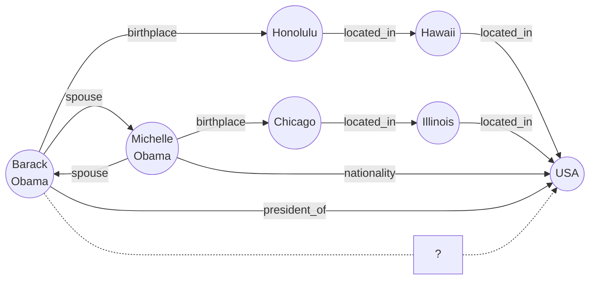
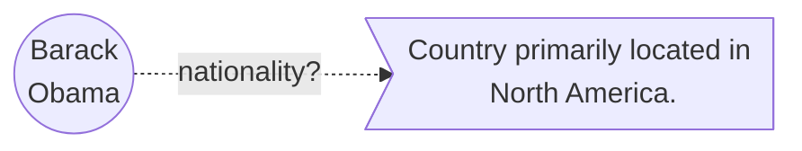

---
# try also 'default' to start simple
theme: seriph
colorSchema: light
# random image from a curated Unsplash collection by Anthony
# like them? see https://unsplash.com/collections/94734566/slidev
#background: https://cover.sli.dev
background:
# some information about your slides, markdown enabled
title: Contrastive Language-Entity Pre-training for Richer Knowledge Graph Embedding
info: |
  ## CLEP paper
# apply any unocss classes to the current slide
author: Andrea Papaluca
class: text-center
# https://sli.dev/custom/highlighters.html
highlighter: shiki
# https://sli.dev/guide/drawing
drawings:
  persist: false
# slide transition: https://sli.dev/guide/animations#slide-transitions
transition: slide-left
# enable MDC Syntax: https://sli.dev/guide/syntax#mdc-syntax
mdc: true
---

## Contrastive Language-Entity Pre-training for Richer Knowledge Graph Embedding

**Andrea Papaluca**, Daniel Krefl, Artem Lensky, Hanna Suominen 

  <a href="https://github.com/BrunoLiegiBastonLiegi/CLEP" target="_blank" alt="GitHub" title="Open in GitHub"
    class="text-xl slidev-icon-btn opacity-50 !border-none !hover:text-white">
    <carbon-logo-github />
  </a>

<!--
The last comment block of each slide will be treated as slide notes. It will be visible and editable in Presenter Mode along with the slide. [Read more in the docs](https://sli.dev/guide/syntax.html#notes)
-->

---
transition: fade-out
---

# The CLEP Architecture

$$
(Barack\;Obama,\, born\_in,\, Honolulu)
$$

  

---
transition: slide-up
---

# A Forward Pass

 $e^{head}$ :  head node of the relational triplet 

 $d^{tail}$ :  description of the tail node 

 

$$
(h_i^{(g)}, \rho_i^{(g)}) = \text{GraphEncoder}\big(e^{head}_i,r_i\big)
$$

 

$$
x_i^{(g)} = h_i^{(g)} + \rho_i^{(g)}
$$

 

$$
\tilde{x}_i^{(g)} = \text{MLP}_g\big(x_i^{(g)}\big)
$$

	

Batch of KG triplets 
$$
\big\{\big(e^{head}_{1},r_1,d^{tail}_{1}\big), \, \ldots \, , \big(e^{head}_n,r_n,d^{tail}_n\big)\big\}\;
$$

 
 
 
 

---

# A Forward Pass

$$
x_i^{(t)} = \text{TextEncoder}\big(d^{tail}_i\big)
$$

$$
\tilde{x}_i^{(t)} = \text{MLP}_t\big(x_i^{(t)}\big)
$$

 
 
 
 
 
 
 

Cosine similarity matrix
$$
m_{i,j} = \frac{\tilde{x}_i^{(g)}\cdot \tilde{x}_j^{(t)}}{\|\tilde{x}_i^{(g)}\|\|\tilde{x}_j^{(t)}\|}\cdot e^\tau
$$

 

 $\tau$ : temperature scaling the logits

---
transition: fade-out
---

# A Forward Pass
 

Row-wise Cross Entropy (CE)

$$
\text{CE}\big(M\big) = -\frac{1}{n} \sum_{i=1}^n \log\frac{e^{m_{i,i}}}{\sum_{j=1}^n e^{m_{i,j}}}
$$

 

 The column-wise CE is obtained by simply taking $\;M\rightarrow M^T$
 
 

 

$$
\mathcal{L}=\frac{1}{2}\bigg(\text{CE}\big(M\big)+\text{CE}\big(M^\top\big)\bigg)
$$

$\longrightarrow$ Enforces minimization of incorrect entity-description associations simultaneously in rows and columns!

---

# The aligned Text-Graph space
 
Euclidean distance of the correct/incorrect entity-description associations

$$
\textcolor{green}{P\bigg(\|\tilde{x}_i^{(g)}-\tilde{x}_i^{(t)}\|\bigg)} \quad\quad \textcolor{red}{P\bigg(\|\tilde{x}_i^{(g)}-\tilde{x}_j^{(t)}\|_{i\neq j}\bigg)}
$$

<v-drag-arrow pos="435,360,86,0" right op70 />

<v-drag pos="440,320,86,0" text-xl>
  CLEP
</v-drag>
 

 
 
 
 
 
 
 
 
 

FB15k-237

<v-drag-arrow pos="720,323,77,0" two-way op70 />
<v-drag pos="716,284,120,40" text>
  2x farther
</v-drag>

---
transition: fade-out
---

# The aligned Text-Graph space

 

YAGO3-10

<v-drag-arrow pos="309,323,216,-146" right op70 color="red"/>

Incorrect pairs closer than correct ones

 $$\|\tilde{x}_i^{(g)}-\tilde{x}_i^{(t)}\|\ \geq \;\|\tilde{x}_i^{(g)}-\tilde{x}_j^{(t)}\|_{i\neq j} $$
 

 
 

Many descriptions are shared over different entities

---
transition: slide-up
---

# Link Prediction across spaces

 

What's Barack Obama's Nationality?

$$
f_s(\text{Barack Obama},\;\text{nationality},\; v) \quad \forall v\in\mathcal{G}
$$

| 
Rank
 | $f_s$ | Link |
| :--- | :--- | :--- |
| 1 | 0.91 | (Barack Obama, nationality, USA) |
| 2 | 0.53 | (Barack Obama, nationality, Hawaii) | 
| 3 | 0.44 | (Barack Obama, nationality, Illinois) | 
| . | . | . |
| . | . | . |
| . | . | . |
| n | 0.11 | (Barack Obama, nationality, Michelle Obama) | 

---

# Link Prediction across spaces

- CLEP is trained to align head entities with tails descriptions $\quad e^{head} + r \sim d^{tail}$

$$
f_s(\text{Barack Obama},\;\text{nationality},\; d(v)) \quad \forall v\in\mathcal{G}
$$

<v-drag pos="10,243,120,40" text>

  $$
  \text{node} \in \text{graph space}
  $$
   
</v-drag>

<v-drag pos="483,233,120,40" text>

  $$
  \text{description} \in \text{text space}
  $$
   
</v-drag>

 
 
Cosine Similarity score

$f_s(h,r,t) = \;\frac{\text{MLP}_g\big(x_{head}^{(g)}\big)\;\cdot\;\text{MLP}_t\big(x_{tail}^{(t)}\big)}{\|\text{MLP}_g\big(x_{head}^{(g)}\big)\|\;\|\text{MLP}_t\big(x_{tail}^{(t)}\big)\|}$

 

|  | MR | MRR | hits@1 | hits@10 |
| - | - | --- | ------ | ------- |
| CompGCNCLEP | **198** | 0.222 | 0.137 | 0.396 |
| RGCN + Distmult | 315 | **0.237** | **0.156** | **0.407** |

<v-drag pos="821,465,120,40" text>
FB15k-237
</v-drag>

---

# Link Prediction Finetuning

- Pretrain with CLEP

<v-drag-arrow pos="622,250,53,1" right op70 />

<v-drag pos="688,216,320,40" text>

$f_s$

</v-drag>

<v-drag pos="225,427,320,40" text>

$$ f_s(h,r,t)=h^TM_rt \quad\quad\quad\quad\quad\quad f_s(h,r,t)=\| h+r-t \|$$

</v-drag>

 
 
 
 
 
 
 
 

- Finetune on pure LP

<v-drag pos="243,397,320,40" text>
RESCAL / DistMult
</v-drag>

<v-drag pos="596,395,320,40" text>
TransE
</v-drag>

---
transition: fade-out
---

# Link Prediction Finetuning

<v-drag pos="700,4,320,40" text>

 &#128311 Randomly initialized model 

 &#128310 CLEP pretrained model 

</v-drag>

FB15k-237

<v-drag pos="857,175,120,40" text>

$$\sim +1\,\text{-}\,2 \%$$

</v-drag>

 
 
 
 
 
 
 

YAGO3-10

<v-drag pos="858,381,120,40" text>

$$\sim +4\,\text{-}\,10 \%$$

</v-drag>

---

# Conclusion and Future Work

<v-clicks every="1">

- CLEP allows for learning an aligned multi-modal Text-Graph space
- Nodes and corresponding textual descriptions are embedded close in this space 
- Properties of the original spaces are preserved: *e.g.* composition of entities and relations  
- Some of the textual information is transferred to the graph encoder during the pre-training  
&rarr; improved performance on downstream tasks without additional textual inputs
- Is the text encoder expected to manifest a similar transfer?  
&rarr; finetuning for instance on Question Answering?
- Any zero-shot capability enabled?  
&rarr; zero-shot Entity Linking: comparison of entity mentions and node embeddings
- Stable diffusion based Graph Generative Model for Information Extraction

</v-clicks>

--- 

 
 
 
 

  

    <h1>Thank your for the Attention!</h1>
  

