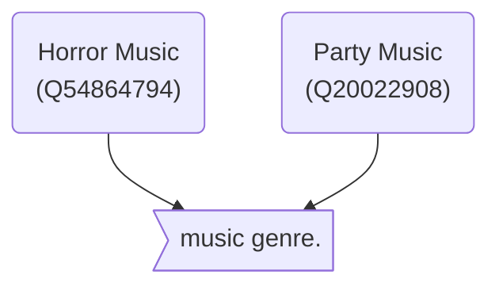
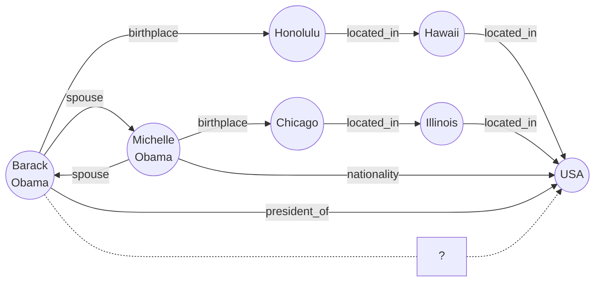
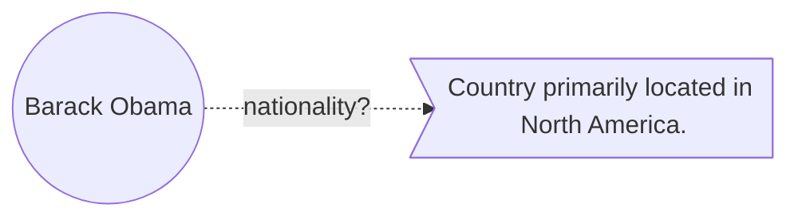
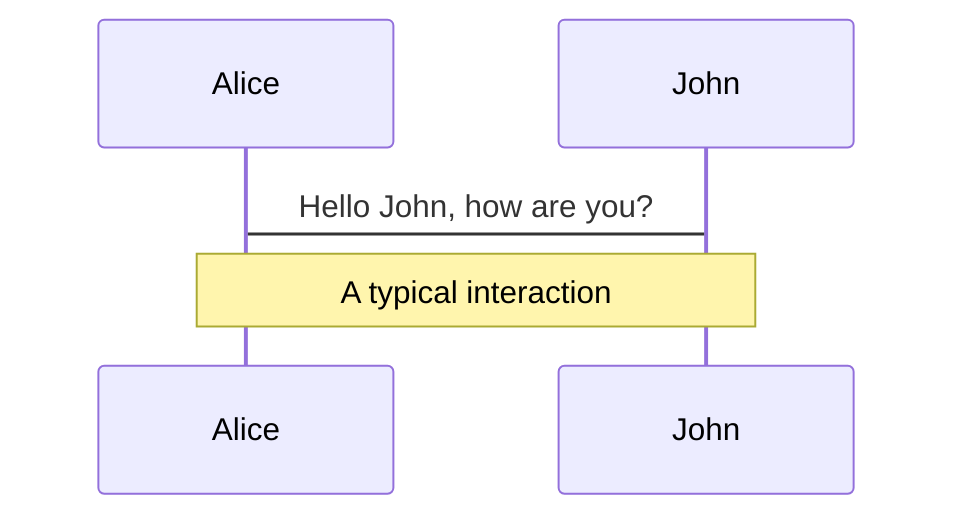
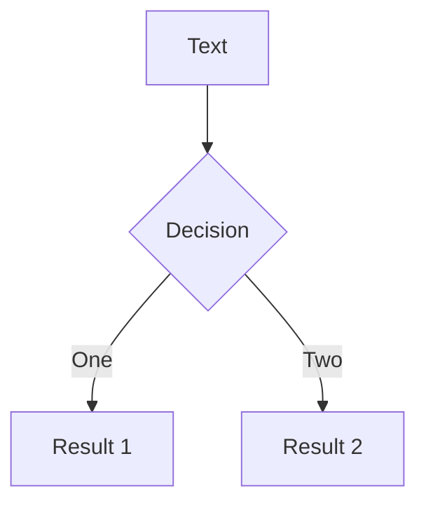
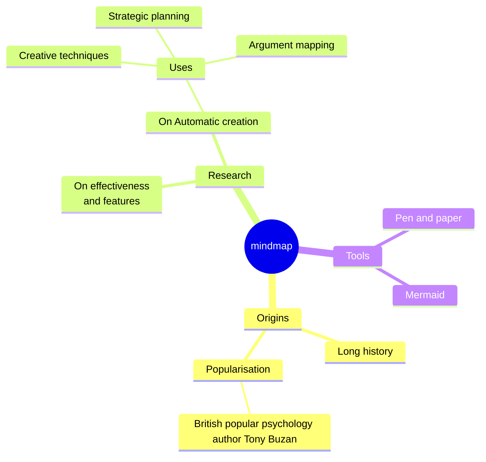
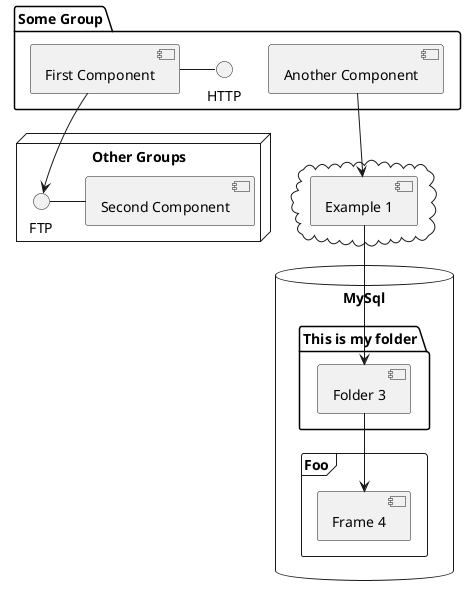

---
# try also 'default' to start simple
theme: seriph
colorSchema: light
# random image from a curated Unsplash collection by Anthony
# like them? see https://unsplash.com/collections/94734566/slidev
#background: https://cover.sli.dev
# some information about your slides, markdown enabled
title: Contrastive Language-Entity Pre-training for Richer Knowledge Graph Embedding
info: |
  ## CLEP paper
# apply any unocss classes to the current slide
author: Andrea Papaluca
class: text-center
# https://sli.dev/custom/highlighters.html
highlighter: shiki
# https://sli.dev/guide/drawing
drawings:
  persist: false
# slide transition: https://sli.dev/guide/animations#slide-transitions
transition: slide-left
# enable MDC Syntax: https://sli.dev/guide/syntax#mdc-syntax
mdc: true
---

## Contrastive Language-Entity Pre-training for Richer Knowledge Graph Embedding

**Andrea Papaluca**, Daniel Krefl, Artem Lensky, Hanna Suominen 


<div class="abs-br m-6 flex gap-2">
  <a href="https://github.com/BrunoLiegiBastonLiegi/CLEP" target="_blank" alt="GitHub" title="Open in GitHub"
    class="text-xl slidev-icon-btn opacity-50 !border-none !hover:text-white">
    <carbon-logo-github />
  </a>
</div>

<!--
The last comment block of each slide will be treated as slide notes. It will be visible and editable in Presenter Mode along with the slide. [Read more in the docs](https://sli.dev/guide/syntax.html#notes)
-->

---
transition: fade-out
---

# The CLEP Architecture

$$
(Barack\;Obama,\, born\_in,\, Honolulu)
$$


  

---
transition: slide-up
---

# A Forward Pass


<div class="grid grid-cols-2 gap-4">
<div>

 $e^{head}$ :  head node of the relational triplet 

 $d^{tail}$ :  description of the tail node 


<br>
<div v-click>
$$
(h_i^{(g)}, \rho_i^{(g)}) = \text{GraphEncoder}\big(e^{head}_i,r_i\big)
$$
</div>
<br>
<div v-click>
$$
x_i^{(g)} = h_i^{(g)} + \rho_i^{(g)}
$$
</div>
<br>
<div v-click>
$$
\tilde{x}_i^{(g)} = \text{MLP}_g\big(x_i^{(g)}\big)
$$
</div>
	
</div>

<div>

Batch of KG triplets 
$$
\big\{\big(e^{head}_{1},r_1,d^{tail}_{1}\big), \, \ldots \, , \big(e^{head}_n,r_n,d^{tail}_n\big)\big\}\;
$$


<br>
<br>
<br>
<br>


<div v-click='1'>

</div>
<div v-click='2'>

</div>
<div v-click='3'>

</div>

</div>

</div>


---

# A Forward Pass

<div class="grid grid-cols-2 gap-4">

<div>
$$
x_i^{(t)} = \text{TextEncoder}\big(d^{tail}_i\big)
$$
<div v-click='1'>
$$
\tilde{x}_i^{(t)} = \text{MLP}_t\big(x_i^{(t)}\big)
$$
</div>
<div v-click='2'>

</div>
</div>

<div>

<div v-click='0'>

</div>
<div v-click='1'>

</div>
<br>
<br>
<br>
<br>
<br>
<br>
<br>
<div v-click='2'>
Cosine similarity matrix
$$
m_{i,j} = \frac{\tilde{x}_i^{(g)}\cdot \tilde{x}_j^{(t)}}{\|\tilde{x}_i^{(g)}\|\|\tilde{x}_j^{(t)}\|}\cdot e^\tau
$$
</div>
<br>
<div v-click='3'>

 $\tau$ : temperature scaling the logits

</div>


</div>

</div>

---
transition: fade-out
---

# A Forward Pass
<br>

Row-wise Cross Entropy (CE)

$$
\text{CE}\big(M\big) = -\frac{1}{n} \sum_{i=1}^n \log\frac{e^{m_{i,i}}}{\sum_{j=1}^n e^{m_{i,j}}}
$$

<div v-click.hide>

</div>

<br>
<div v-click='1'>

 The column-wise CE is obtained by simply taking $\;M\rightarrow M^T$
 
 


</div>
<br>
<div v-click='2'>

$$
\mathcal{L}=\frac{1}{2}\bigg(\text{CE}\big(M\big)+\text{CE}\big(M^\top\big)\bigg)
$$

$\longrightarrow$ Enforces minimization of incorrect entity-description associations simultaneously in rows and columns!

</div>

---

# The aligned Text-Graph space
<br>
Euclidean distance of the correct/incorrect entity-description associations

$$
\textcolor{green}{P\bigg(\|\tilde{x}_i^{(g)}-\tilde{x}_i^{(t)}\|\bigg)} \quad\quad \textcolor{red}{P\bigg(\|\tilde{x}_i^{(g)}-\tilde{x}_j^{(t)}\|_{i\neq j}\bigg)}
$$


<div class="grid grid-cols-2 gap-4">

<div v-click='1'>

</div>

<div>
<div v-click='2'>
<v-drag-arrow pos="435,360,86,0" right op70 />

<v-drag pos="440,320,86,0" text-xl>
  CLEP
</v-drag>
 

</div>
</div>

</div>

<br>
<br>
<br>
<br>
<br>
<br>
<br>
<br>
<br>
<div v-click='1'>
<div align="center">FB15k-237</div>
</div>

<div v-click='3'>
<v-drag-arrow pos="720,323,77,0" two-way op70 />
<v-drag pos="716,284,120,40" text>
  2x farther
</v-drag>

</div>

---
transition: fade-out
---

# The aligned Text-Graph space

<div class="grid grid-cols-2 gap-4">

<div>
<br>
<div align="center">YAGO3-10</div>

<div v-click='1'>

<v-drag-arrow pos="309,323,216,-146" right op70 color="red"/>
</div>
</div>

<div>

<div v-click='1' align="center">

Incorrect pairs closer than correct ones

 $$\|\tilde{x}_i^{(g)}-\tilde{x}_i^{(t)}\|\ \geq \;\|\tilde{x}_i^{(g)}-\tilde{x}_j^{(t)}\|_{i\neq j} $$
 
</div>
<br>
<br>
<div v-click='2' align="center">

Many descriptions are shared over different entities


</div>


</div>


</div>

---
transition: slide-up
---

# Link Prediction across spaces

<div class="grid grid-cols-[550px_400px] gap-4">

<div>

<div>



</div>

<br>

<div v-click='1' align="center">
What's Barack Obama's Nationality?

$$
f_s(\text{Barack Obama},\;\text{nationality},\; v) \quad \forall v\in\mathcal{G}
$$

</div>

</div>

<div>

<div v-click='2' style="font-size:60%;">

| <div style="width:15px">Rank</div> | $f_s$ | Link |
| :--- | :--- | :--- |
| 1 | 0.91 | (Barack Obama, nationality, USA) |
| 2 | 0.53 | (Barack Obama, nationality, Hawaii) | 
| 3 | 0.44 | (Barack Obama, nationality, Illinois) | 
| . | . | . |
| . | . | . |
| . | . | . |
| n | 0.11 | (Barack Obama, nationality, Michelle Obama) | 

</div>

</div>

<div>


</div>

</div>

---

# Link Prediction across spaces

* CLEP is trained to align head entities with tails descriptions $\quad(e^{head},\;r,\;d^{tail})$

$$
f_s(\text{Barack Obama},\;\text{nationality},\; d(v)) \quad \forall v\in\mathcal{G}
$$

<v-drag pos="19,302,120,40" text>

  $$
  \text{node} \in \text{graph space}
  $$
   
</v-drag>

<v-drag pos="485,264,120,40" text>

  $$
  \text{description} \in \text{text space}
  $$
   
</v-drag>



---

# What is Slidev?

Slidev is a slides maker and presenter designed for developers, consist of the following features

- 📝 **Text-based** - focus on the content with Markdown, and then style them later
- 🎨 **Themable** - theme can be shared and used with npm packages
- 🧑‍💻 **Developer Friendly** - code highlighting, live coding with autocompletion
- 🤹 **Interactive** - embedding Vue components to enhance your expressions
- 🎥 **Recording** - built-in recording and camera view
- 📤 **Portable** - export into PDF, PPTX, PNGs, or even a hostable SPA
- 🛠 **Hackable** - anything possible on a webpage

<br>
<br>

Read more about [Why Slidev?](https://sli.dev/guide/why)

<!--
You can have `style` tag in markdown to override the style for the current page.
Learn more: https://sli.dev/guide/syntax#embedded-styles
-->

<style>
h1 {
  background-color: #2B90B6;
  background-image: linear-gradient(45deg, #4EC5D4 10%, #146b8c 20%);
  background-size: 100%;
  -webkit-background-clip: text;
  -moz-background-clip: text;
  -webkit-text-fill-color: transparent;
  -moz-text-fill-color: transparent;
}
</style>

<!--
Here is another comment.
-->

---
transition: slide-up
level: 2
---

# Navigation

Hover on the bottom-left corner to see the navigation's controls panel, [learn more](https://sli.dev/guide/navigation.html)

## Keyboard Shortcuts

|     |     |
| --- | --- |
| <kbd>right</kbd> / <kbd>space</kbd>| next animation or slide |
| <kbd>left</kbd>  / <kbd>shift</kbd><kbd>space</kbd> | previous animation or slide |
| <kbd>up</kbd> | previous slide |
| <kbd>down</kbd> | next slide |

<!-- https://sli.dev/guide/animations.html#click-animations -->

<p v-after class="absolute bottom-23 left-45 opacity-30 transform -rotate-10">Here!</p>

---
layout: two-cols
layoutClass: gap-16
---

# Table of contents

You can use the `Toc` component to generate a table of contents for your slides:

```html
<Toc minDepth="1" maxDepth="1"></Toc>
```

The title will be inferred from your slide content, or you can override it with `title` and `level` in your frontmatter.

::right::

<Toc v-click minDepth="1" maxDepth="2"></Toc>

---
layout: image-right
image: https://cover.sli.dev
---

# Code

Use code snippets and get the highlighting directly, and even types hover![^1]

```ts {all|5|7|7-8|10|all} twoslash
// TwoSlash enables TypeScript hover information
// and errors in markdown code blocks
// More at https://shiki.style/packages/twoslash

import { computed, ref } from 'vue'

const count = ref(0)
const doubled = computed(() => count.value * 2)

doubled.value = 2
```

<arrow v-click="[4, 5]" x1="350" y1="310" x2="195" y2="334" color="#953" width="2" arrowSize="1" />

<!-- This allow you to embed external code blocks -->
<<< @/snippets/external.ts#snippet

<!-- Footer -->
[^1]: [Learn More](https://sli.dev/guide/syntax.html#line-highlighting)

<!-- Inline style -->
<style>
.footnotes-sep {
  @apply mt-5 opacity-10;
}
.footnotes {
  @apply text-sm opacity-75;
}
.footnote-backref {
  display: none;
}
</style>

<!--
Notes can also sync with clicks

[click] This will be highlighted after the first click

[click] Highlighted with `count = ref(0)`

[click:3] Last click (skip two clicks)
-->

---
level: 2
---

# Shiki Magic Move

Powered by [shiki-magic-move](https://shiki-magic-move.netlify.app/), Slidev supports animations across multiple code snippets.

Add multiple code blocks and wrap them with <code>````md magic-move</code> (four backticks) to enable the magic move. For example:

````md magic-move {lines: true}
```ts {*|2|*}
// step 1
const author = reactive({
  name: 'John Doe',
  books: [
    'Vue 2 - Advanced Guide',
    'Vue 3 - Basic Guide',
    'Vue 4 - The Mystery'
  ]
})
```

```ts {*|1-2|3-4|3-4,8}
// step 2
export default {
  data() {
    return {
      author: {
        name: 'John Doe',
        books: [
          'Vue 2 - Advanced Guide',
          'Vue 3 - Basic Guide',
          'Vue 4 - The Mystery'
        ]
      }
    }
  }
}
```

```ts
// step 3
export default {
  data: () => ({
    author: {
      name: 'John Doe',
      books: [
        'Vue 2 - Advanced Guide',
        'Vue 3 - Basic Guide',
        'Vue 4 - The Mystery'
      ]
    }
  })
}
```

Non-code blocks are ignored.

```vue
<!-- step 4 -->
<script setup>
const author = {
  name: 'John Doe',
  books: [
    'Vue 2 - Advanced Guide',
    'Vue 3 - Basic Guide',
    'Vue 4 - The Mystery'
  ]
}
</script>
```
````

---

# Components

<div grid="~ cols-2 gap-4">
<div>

You can use Vue components directly inside your slides.

We have provided a few built-in components like `<Tweet/>` and `<Youtube/>` that you can use directly. And adding your custom components is also super easy.

```html
<Counter :count="10" />
```

<!-- ./components/Counter.vue -->
<Counter :count="10" m="t-4" />

Check out [the guides](https://sli.dev/builtin/components.html) for more.

</div>
<div>

```html
<Tweet id="1390115482657726468" />
```

<Tweet id="1390115482657726468" scale="0.65" />

</div>
</div>

<!--
Presenter note with **bold**, *italic*, and ~~striked~~ text.

Also, HTML elements are valid:
<div class="flex w-full">
  <span style="flex-grow: 1;">Left content</span>
  <span>Right content</span>
</div>
-->

---
class: px-20
---

# Themes

Slidev comes with powerful theming support. Themes can provide styles, layouts, components, or even configurations for tools. Switching between themes by just **one edit** in your frontmatter:

<div grid="~ cols-2 gap-2" m="t-2">

```yaml
---
theme: default
---
```

```yaml
---
theme: seriph
---
```


</div>

Read more about [How to use a theme](https://sli.dev/themes/use.html) and
check out the [Awesome Themes Gallery](https://sli.dev/themes/gallery.html).

---

# Clicks Animations

You can add `v-click` to elements to add a click animation.

<div v-click>

This shows up when you click the slide:

```html
<div v-click>This shows up when you click the slide.</div>
```

</div>

<br>

<v-click>

The <span v-mark.red="3"><code>v-mark</code> directive</span>
also allows you to add
<span v-mark.circle.orange="4">inline marks</span>
, powered by [Rough Notation](https://roughnotation.com/):

```html
<span v-mark.underline.orange>inline markers</span>
```

</v-click>

<div mt-20 v-click>

[Learn More](https://sli.dev/guide/animations#click-animations)

</div>

---

# Motions

Motion animations are powered by [@vueuse/motion](https://motion.vueuse.org/), triggered by `v-motion` directive.

```html
<div
  v-motion
  :initial="{ x: -80 }"
  :enter="{ x: 0 }"
  :click-3="{ x: 80 }"
  :leave="{ x: 1000 }"
>
  Slidev
</div>
```

<div class="w-60 relative">
  <div class="relative w-40 h-40">
    
    
    
  </div>

  <div
    class="text-5xl absolute top-14 left-40 text-[#2B90B6] -z-1"
    v-motion
    :initial="{ x: -80, opacity: 0}"
    :enter="{ x: 0, opacity: 1, transition: { delay: 2000, duration: 1000 } }">
    Slidev
  </div>
</div>

<!-- vue script setup scripts can be directly used in markdown, and will only affects current page -->
<script setup lang="ts">
const final = {
  x: 0,
  y: 0,
  rotate: 0,
  scale: 1,
  transition: {
    type: 'spring',
    damping: 10,
    stiffness: 20,
    mass: 2
  }
}
</script>

<div
  v-motion
  :initial="{ x:35, y: 30, opacity: 0}"
  :enter="{ y: 0, opacity: 1, transition: { delay: 3500 } }">

[Learn More](https://sli.dev/guide/animations.html#motion)

</div>

---

# LaTeX

LaTeX is supported out-of-box powered by [KaTeX](https://katex.org/).

<br>

Inline $\sqrt{3x-1}+(1+x)^2$

Block
$$ {1|3|all}
\begin{array}{c}

\nabla \times \vec{\mathbf{B}} -\, \frac1c\, \frac{\partial\vec{\mathbf{E}}}{\partial t} &
= \frac{4\pi}{c}\vec{\mathbf{j}}    \nabla \cdot \vec{\mathbf{E}} & = 4 \pi \rho \\

\nabla \times \vec{\mathbf{E}}\, +\, \frac1c\, \frac{\partial\vec{\mathbf{B}}}{\partial t} & = \vec{\mathbf{0}} \\

\nabla \cdot \vec{\mathbf{B}} & = 0

\end{array}
$$

<br>

[Learn more](https://sli.dev/guide/syntax#latex)

---

# Diagrams

You can create diagrams / graphs from textual descriptions, directly in your Markdown.

<div class="grid grid-cols-4 gap-5 pt-4 -mb-6">









</div>

[Learn More](https://sli.dev/guide/syntax.html#diagrams)

---
foo: bar
dragPos:
  square: 679,30,167,_,-16
---

# Draggable Elements

Double-click on the draggable elements to edit their positions.

<br>

###### Directive Usage

```md

```

<br>

###### Component Usage

```md
<v-drag text-3xl>
  <carbon:arrow-up />
  Use the `v-drag` component to have a draggable container!
</v-drag>
```

<v-drag pos="663,206,261,_,-15">
  <div text-center text-3xl border border-main rounded>
    Double-click me!
  </div>
</v-drag>


###### Draggable Arrow

```md
<v-drag-arrow two-way />
```

<v-drag-arrow pos="116,458,252,14" two-way op70 />

---
src: ./pages/multiple-entries.md
hide: false
---

---

# Monaco Editor

Slidev provides built-in Monaco Editor support.

Add `{monaco}` to the code block to turn it into an editor:

```ts {monaco}
import { ref } from 'vue'
import { emptyArray } from './external'

const arr = ref(emptyArray(10))
```

Use `{monaco-run}` to create an editor that can execute the code directly in the slide:

```ts {monaco-run}
import { version } from 'vue'
import { emptyArray, sayHello } from './external'

sayHello()
console.log(`vue ${version}`)
console.log(emptyArray<number>(10).reduce(fib => [...fib, fib.at(-1)! + fib.at(-2)!], [1, 1]))
```

---
layout: center
class: text-center
---

# Learn More

[Documentations](https://sli.dev) · [GitHub](https://github.com/slidevjs/slidev) · [Showcases](https://sli.dev/showcases.html)
